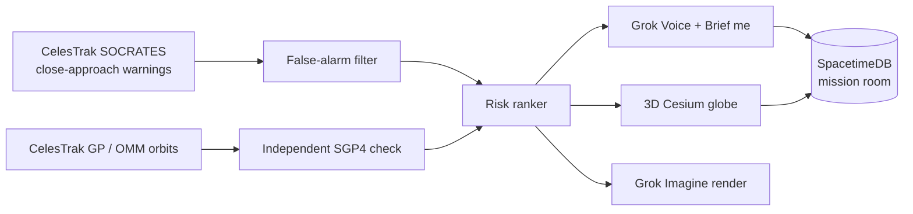

<div align="center">

# 🛰️ Orbit Watch

### Space traffic control for the 99% of operators who don't have a control room.

**A Grok voice copilot that reads real collision warnings, throws out the false alarms, and tells you, out loud, which one actually matters. Now with a live mission room on SpacetimeDB, so the whole team sees the same picture.**

[**🌍 Live site**](https://orbit-watch-nu.vercel.app) · [**📡 CelesTrak SOCRATES**](https://celestrak.org/SOCRATES/) · Built for the SpaceXAI *Make it Legendary* hackathon

</div>

---

> **Not for operational use.** Orbit Watch is a demo of triage and explanation built on public data. It does not replace the 18th Space Defense Squadron, a conjunction-assessment team, or a maneuver decision, and it never gives maneuver orders.

## 🚨 The real threat tonight

On **Sunday, Oct 4, 2026 at 9:26 PM ET** (2026-10-05 01:26:28 UTC), **SwissCube** (NORAD 35932), a 1U CubeSat built by EPFL students, is predicted to pass **621 meters** from Soviet rocket debris, **SL-8 DEB** (NORAD 19831), at **13.881 km/s** (about 50,000 km/h).

| | |
|---|---|
| **Primary** | SwissCube · NORAD 35932 · ~685 km sun-synchronous · no thrusters |
| **Secondary** | SL-8 DEB · NORAD 19831 |
| **Time of closest approach** | 2026-10-05 01:26:28.592 UTC |
| **Miss distance** | 0.621 km (CelesTrak SOCRATES) · 0.691 km (our own SGP4 run) |
| **Relative speed** | 13.881 km/s |
| **Max probability** | 5.614 × 10⁻⁶ |
| **Verdict** | **Act** (priority score 84.0), the one pass the team should look at. Not a maneuver order. |

[Check the SwissCube report on CelesTrak yourself →](https://celestrak.org/SOCRATES/table-socrates.php?CATNR=35932&ORDER=MINRANGE&MAX=25)

## 🤯 The problem

CelesTrak's SOCRATES screens the whole tracked catalog, and one weekly run lists **183,612** predicted close approaches. Big operators have flight dynamics teams. University CubeSat teams have a grad student and a spreadsheet. Most warnings are noise, but you can't safely ignore any of them.

## 💡 What Orbit Watch does



For SwissCube this week:

- **21** warnings screened
- **19** dismissed automatically, each with a reason
  - 1 co-orbiting (BEESAT-1, its 2009 launch sibling: 4.368 km apart but drifting at only 0.078 km/s)
  - 16 below the probability threshold
  - 2 duplicate passes
- **2** kept
  - 🔴 **SL-8 DEB**: *Act* (84.0)
  - 🟡 **SL-8 R/B**: *Watch* (66.9)

From 21 alarms to 1 decision.

## ✨ Features

**Triage and voice**
- 🚨 **Heads-up alert:** a banner with a live countdown to tonight's pass as soon as the page loads, plus **Play alert** and **Replay alert**.
- 📢 **Brief me:** one tap for a short spoken briefing. The text appears instantly and the audio streams.
- 🗣️ **Talk to Grok:** hold the mic and ask "What's the biggest threat tonight?" or "Why did you dismiss the others?" Grok Voice calls tools for every number (`get_ranked_warnings`, `get_encounter`, `explain_dismissed`, `focus_encounter`) and can fly the globe to the pass it's talking about.
- 🔇 **Voice on/off** switch and 📤 **Share this alert** (native share sheet or copy to clipboard).

**Globe and proof**
- 🌍 **3D Cesium globe:** both orbits around the encounter, a pulsing closest-approach marker, a side label, colored orbits, Show dismissed, Reset view, and a play/pause scrubber.
- 🎨 **Grok Imagine renders** of the selected encounter, labeled as an artist's rendering, not a photograph.
- ✅ **Verify on CelesTrak** links on every threat.
- 🧮 **Our own math:** we propagate both orbits with SGP4 and cross-check CelesTrak's miss distance (691 m vs 621 m).

**Any CubeSat**
- 🔭 **Track another CubeSat:** type a NORAD number or pick from the **Known** list (AO-91, HUCSat, ESTCube-1), choose a **Horizon** of 24 hours, 72 hours, or 7 days, and hit **Track**. The cards, globe, voice, and Brief me all switch to that satellite. **Back to SwissCube** returns to the demo.

**Live mission room (SpacetimeDB)**
- 🟢 **Status pill** on each kept threat (Watching / Act / Dismissed). Anyone can change it, and it updates on every open screen.
- 📝 **Note thread** under each threat.
- 👥 **"N watching"** in the header, from live presence. Each tab counts separately.
- 📡 **Team feed:** status changes, Brief me, and the heads-up alert post into a shared feed, for example `Grok briefed: SL-8 DEB 621 m at 9:26 PM`.
- 🪪 **Callsign:** the first visit asks for one (prefilled like `Operator-1234`) and remembers it.
- The room is off unless both SpacetimeDB settings are present, so the solo app never changes.

## 🧠 How the ranking works

1. **Is it real?** Co-orbiting objects (relative speed under 0.10 km/s), duplicate passes, and negligible-probability events are dismissed, with the reason shown.
2. **How bad would it be?** A 0–100 score with weights: probability 0.40, miss distance 0.25, relative speed 0.15, time to closest approach 0.10, and whether the other object can be coordinated with 0.10.
3. **What should we do?** Act if score ≥ 70 or max probability ≥ 1e-5. Watch is 40–70. Info is below 40.

**Calibrated for CubeSats.** The build plan's original probability term `(log10(p)+7)/4` fits ISS-class events. Public SOCRATES probabilities for a CubeSat that can't maneuver sit around 1e-6 to 1e-5, so that scale left a 621 m head-on pass in the low 60s. The probability term is now `clamp((log10(p)+8)/3, 0, 1)` (1e-8 → 0, 1e-5 → 1), which puts SL-8 DEB at 84. The 1e-4 NASA CARA figure is an operational maneuver threshold, not what this public screen reports for SwissCube, so it isn't the Act gate here.

Stale data (more than 3 days since epoch) and dilution (dilution larger than the miss) show as flags on the card. They don't change the score.

### Why 621 m vs 691 m?

Both use SGP4, but they start from orbit data published at different times. CelesTrak screened from earlier element sets. Ours are real CelesTrak GP data fetched later on Oct 3. Public orbit data is uncertain by hundreds of meters, which is why SOCRATES also reports a probability. Two independent calculations about 70 m apart tell you the threat is real.

## 🚀 Run it locally

Requires Node.js and npm.

```bash
git clone https://github.com/ArunimaV/orbit-watch.git
cd orbit-watch
npm install
cp .env.example .env.local     # then add your XAI_API_KEY (see below)
npm test                       # optional
npm run dev
```

Open http://localhost:3000. The app opens on SwissCube vs SL-8 DEB.

### Environment variables

| Variable | Required | Purpose |
|---|---|---|
| `XAI_API_KEY` | For live voice | Server-only key from [console.x.ai](https://console.x.ai) for realtime voice, Brief me, text-to-speech, and new Imagine renders. Never ship it to the browser. Without it, the app runs in mock mode: the mic is off, Brief me still reads the ranker's text, and the committed SwissCube render is shown. |
| `NEXT_PUBLIC_SPACETIME_URI` | For the mission room | SpacetimeDB server, e.g. `https://maincloud.spacetimedb.com` or `http://127.0.0.1:3100`. Public, not a secret. |
| `NEXT_PUBLIC_SPACETIME_MODULE` | For the mission room | Database name, e.g. `orbit-watch`. Both SpacetimeDB values must be set or the room stays off. |
| `ORBIT_WATCH_OFFLINE` | No | `1` skips CelesTrak and serves `data/fixtures/` only. |
| `DEMO_NOW` | No | Fixture-mode clock (ISO). Empty uses `2026-10-04T16:00:00Z` (noon ET Oct 4), so SL-8 DEB stays ranked and reads as "tonight." |
| `NEXT_PUBLIC_CESIUM_ION_TOKEN` | No | Unused. The globe uses Natural Earth II imagery bundled with Cesium. |

### Optional: turn on the live mission room (SpacetimeDB)

The module lives in `spacetime/`. Generated client bindings are in `lib/spacetime/module_bindings/`, and `spacetime.json` points at `./spacetime` with Maincloud as the default server.

1. **Install the SpacetimeDB CLI** (2.10.2 used here) and check it:
   ```bash
   curl -sSf https://install.spacetimedb.com | sh
   spacetime --version
   ```
   Add `~/.local/bin` to your PATH if the installer asks, then open a new terminal.
2. **Log in** (opens a browser for GitHub or Google):
   ```bash
   spacetime login
   ```
3. **Publish the module** from the repo root:
   ```bash
   npm install --prefix spacetime
   spacetime publish orbit-watch --server maincloud
   ```
   If `orbit-watch` is taken, pick another lowercase name with dashes and use it below. Re-run the same command to update the module. Compatible schema changes keep the data.
4. **Add to `.env.local`:**
   ```bash
   NEXT_PUBLIC_SPACETIME_URI=https://maincloud.spacetimedb.com
   NEXT_PUBLIC_SPACETIME_MODULE=orbit-watch
   ```
5. **Restart** `npm run dev`, then open http://localhost:3000 in **two windows** side by side. Join with a different callsign in each. The header shows "2 watching." Set **Act** on SL-8 DEB in one window, add a note, or hit **Brief me**, and watch it appear in the other.

**Inspect the data:**
```bash
spacetime sql orbit-watch "SELECT * FROM threat_status" --server maincloud
```
Swap in `note`, `presence`, or `feed`. You can also browse the tables on the SpacetimeDB dashboard.

**Fully local instead of Maincloud.** Next.js uses port 3000, so run SpacetimeDB on 3100:
```bash
spacetime start --listen-addr 127.0.0.1:3100
# in another terminal, from the repo root:
npm install --prefix spacetime
spacetime publish orbit-watch --server http://127.0.0.1:3100 --yes
```
and set `NEXT_PUBLIC_SPACETIME_URI=http://127.0.0.1:3100`.

#### Mission room schema

| Table | Holds | Written by reducer |
|---|---|---|
| `threat_status` | Watching / Act / Dismissed per encounter, who set it, when | `setStatus` |
| `note` | Per-encounter note thread (author, text, time) | `addNote` |
| `presence` | One row per live connection with callsign and last heartbeat | `heartbeat` (removed on disconnect, stale rows pruned after 45 s) |
| `feed` | System and Grok lines. Duplicates within 20 s are dropped, and the latest 40 are kept. | `postFeed` |

Every reducer validates its input first: allowed status values, length limits (names 40, notes 280, feed 320 characters), a safe character set, and no control characters. Clients subscribe to the tables and don't poll.

## 📡 Data sources

- **Close approaches:** [CelesTrak SOCRATES Plus](https://celestrak.org/SOCRATES/) ([format](https://celestrak.org/SOCRATES/socrates-format.php)).
- **Orbits:** [CelesTrak GP / OMM](https://celestrak.org/NORAD/documentation/gp-data-formats.php), always requested with `FORMAT=JSON` and propagated with satellite.js v7 `json2satrec` (SGP4). TLEs aren't used, because catalog numbers already exceed five digits.

**What's real.** `data/fixtures/socrates-sample.json` holds the real SOCRATES Plus screen for SwissCube (21 rows, data current as of 2026-10-03 00:19:27 UTC). The GP files in `data/fixtures/gp/` are real CelesTrak element sets fetched on Oct 3 for 11 objects. The demo serves this committed snapshot by default so judging is stable. `npm run ingest` pulls a fresh screen. Lookups for other satellites (`/api/lookup`) make one live SOCRATES request with an 8-second timeout, cached for 10 hours.

**CelesTrak usage policy.** We cache under `data/`, poll `jsonDir.php` at most once an hour, download the screen only when `FILE_MTIME` changes, refetch a GP set only when the cache is more than 2 hours old, and stop on the first non-200 response with no retries. HTTPS to `celestrak.org` times out from some networks, so a transport failure is tried once over plain `http://` with the same path.

Data courtesy of [CelesTrak](https://celestrak.org/) (Dr. T.S. Kelso).

## 🔌 API routes

- `GET /api/conjunctions?norad=35932&horizon=168`: ranked cards plus dismissed counts by reason.
- `GET /api/lookup?norad=43017&horizon=168`: the same ranked payload for any other catalog number.
- `GET /api/encounter/[id]`: both OMMs through `json2satrec`, positions every 10 s from TCA−15 min to TCA+15 min, and our own minimum separation.
- `POST /api/voice/token`: mints a short-lived realtime client secret (the key stays on the server).
- `POST /api/voice/tools`: `get_ranked_warnings`, `get_encounter`, `explain_dismissed`, `focus_encounter`.
- `POST /api/brief`: short briefing from `grok-4.20-0309-non-reasoning`, with the ranker text as fallback.
- `POST /api/tts`: Eve voice, `audio/mpeg`.
- `GET /api/imagine/[id]`: Grok Imagine render (`grok-imagine-image-quality`), cached, with the committed `public/renders/swisscube-sl8deb.jpg` as the default and fallback.

## ▲ Deploy to Vercel

The Next.js preset works as is. `next.config.ts` copies Cesium's static files into `public/cesium` when the config loads, so `next build` publishes them. Set `XAI_API_KEY` for live voice. To enable the mission room on the live site, also add `NEXT_PUBLIC_SPACETIME_URI` and `NEXT_PUBLIC_SPACETIME_MODULE` and **redeploy**, because Vercel reads `NEXT_PUBLIC_*` at build time. Without them, the live site runs the solo app.

## 🛠️ Built with

| | |
|---|---|
| **Cursor** | All code written in Cursor. Several Cursor cloud agents built features in parallel on separate PRs (#1–#16), with small, frequent commits. |
| **Grok Voice API** | Realtime push-to-talk (`grok-voice-latest`) with tool calls, plus TTS for briefings |
| **Grok Imagine** | Artist's renderings of each encounter |
| **Grok API** | Fast spoken briefings |
| **SpacetimeDB** | Real-time backend for the shared mission room (tables, reducers, subscriptions, presence) |
| **CelesTrak** | SOCRATES close approaches and GP/OMM orbit data |
| **satellite.js** | SGP4 propagation |
| **Next.js + CesiumJS + Resium** | App and 3D globe |
| **Vercel** | Hosting |
| **Grok Bot** | Planning, research, and coordinating the build agents. See `docs/planning-log.md`. |

## 🔭 What's next

- Mission room on the live site for every team, with a history of status changes.
- Automatic re-screening as a pass gets closer, and alerts by text or email for new threats.
- "What can we actually do?" guidance for teams with and without propulsion.
- Day one for new teams: when our own CubeSat launches, we'll be watching from the first orbit.

## 🙏 Credits

Conjunction and orbit data from [CelesTrak](https://celestrak.org) (Dr. T.S. Kelso). SwissCube was built by students at EPFL. satellite.js, CesiumJS, and SpacetimeDB. Predictions are based on public orbit data and are not for operational use.

<div align="center">

**Made with 🛰️ for every team launching their first satellite.**

</div>
